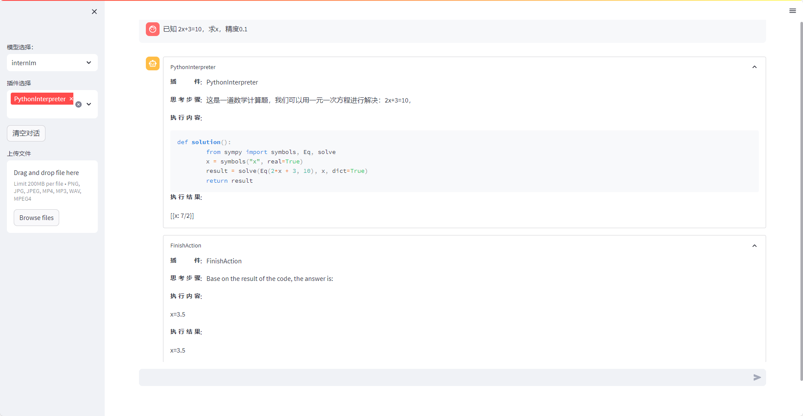

# 第一次作业

#### 1、使用 InternLM-Chat-7B 模型生成 300 字的小故事（需截图）。

####  2、熟悉 hugging face 下载功能，使用 `huggingface_hub` python 包，下载 `InternLM-20B` 的 config.json 文件到本地（需截图下载过程）。

####  3、完成浦语·灵笔的图文理解及创作部署（需截图）

#### 4、完成 Lagent 工具调用 Demo 创作部署（需截图）

